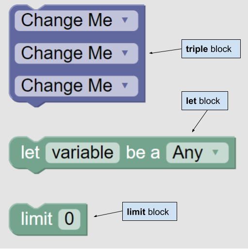
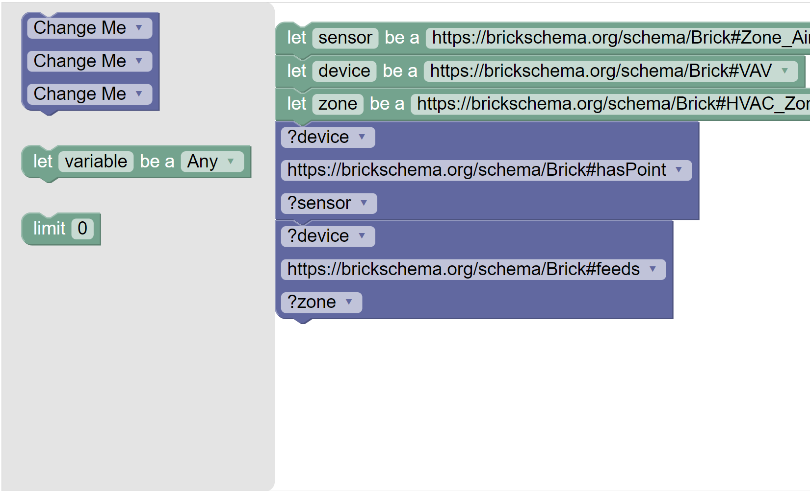

# Brickly
A block based editor for SPARQL queries with Brick.

## How does it work?
This application is intended to make [SPARQL](https://www.w3.org/TR/rdf-sparql-query/) queries on [BrickSchema](https://brickschema.org/) defined buildings easier to query for beginners who are unfamiliar with SPARQL syntax.

Brickly uses [Google's Blockly API](https://developers.google.com/blockly) to create easy-to-use blocks for your querying needs.  

There are three types of blocks:
 - **triple** blocks are the heart of querying. They represent a [RDF triple](https://www.w3.org/TR/rdf11-primer/#section-triple) which has a `subject`, `predicate`, and `object`. Though the triple block reads top down, each dropdown corresponds left to right as subject -> predicate -> object.
 - **let** blocks allow for variable creation. Given a `variableName` and a `type` selected in a dropdown, a line of the form will be created upon querying: `?variableName rdf:type <type> .`
 - **limit** blocks limit the resultant amount of data queried.

The prefixes `brick`, `unit`, `owl`, `rdf`, and `rdfs` are included by default in Brickly.

## Running the app
After cloning, the app can be started using the `Dockerfile`:

    cd brickly
    docker build -t brickly .
    docker run -dp 5000:5000 --rm -v `pwd`:/opt brickly bldg.ttl

Note that on Windows, `%cd%` must be used instead of ``pwd``.

    docker run -dp 5000:5000 --rm -v %cd%:/opt brickly bldg.ttl

Note that any valid turtle (.ttl) file can be used to query against instead of the example `bldg.ttl`.
## Example Query Creation

An example demo video can be viewed [here](https://youtu.be/cSFBMrzIK1s). Detailed instructions can be found below.

Create three "let" blocks, named "sensor" "device" and "zone" respectively. Sensor should be a `https://brickschema.org/schema/Brick#Zone_Air_Temperature_Sensor`, device should be a `https://brickschema.org/schema/Brick#VAV` and zone should be a `https://brickschema.org/schema/Brick#HVAC_Zone`.

Next, create a new "triple" block. 
 - Select `?device` in the upper dropdown. 
 - Select `https://brickschema.org/schema/Brick#hasPoint` in the middle dropdown. 
 - Select `?sensor` in the lower dropdown.

Create another "triple" block. 
 - Select `?device` in the upper dropdown. 
 - Select `https://brickschema.org/schema/Brick#feeds` in the middle dropdown. 
 - Select `?zone` in the lower dropdown.

This should result in the image below.

Click the arrow icon in the top right of the "Run Query" container to run the query against an example building file.

The generated code (as a result of the block query) should look like:

    SELECT * WHERE {
	    ?sensor rdf:type <https://brickschema.org/schema/Brick#Zone_Air_Temperature_Sensor> .
	    ?device rdf:type <https://brickschema.org/schema/Brick#VAV> .
	    ?zone rdf:type <https://brickschema.org/schema/Brick#HVAC_Zone> .
	    ?device <https://brickschema.org/schema/Brick#hasPoint> ?sensor .
	    ?device <https://brickschema.org/schema/Brick#feeds> ?zone .
    }
